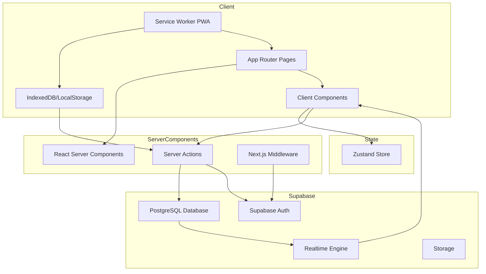
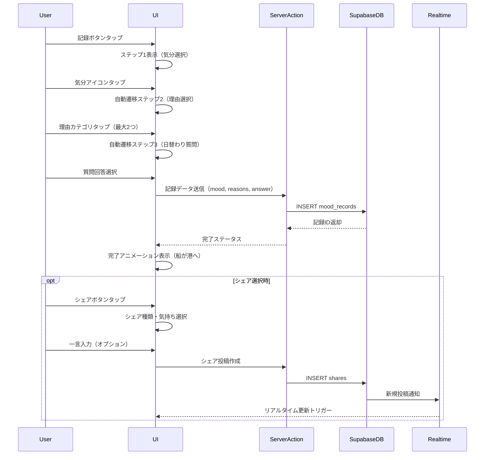
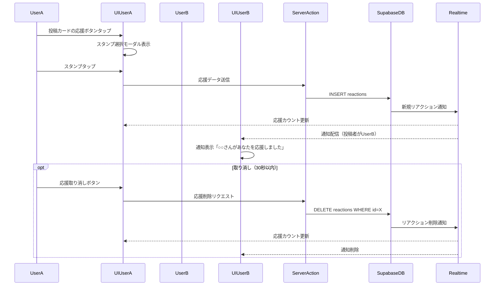
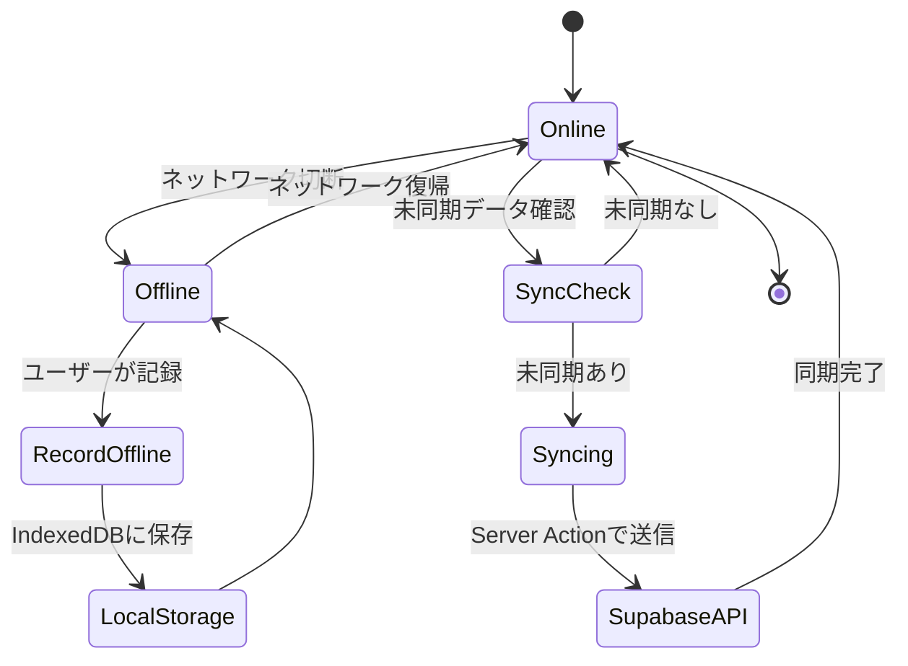
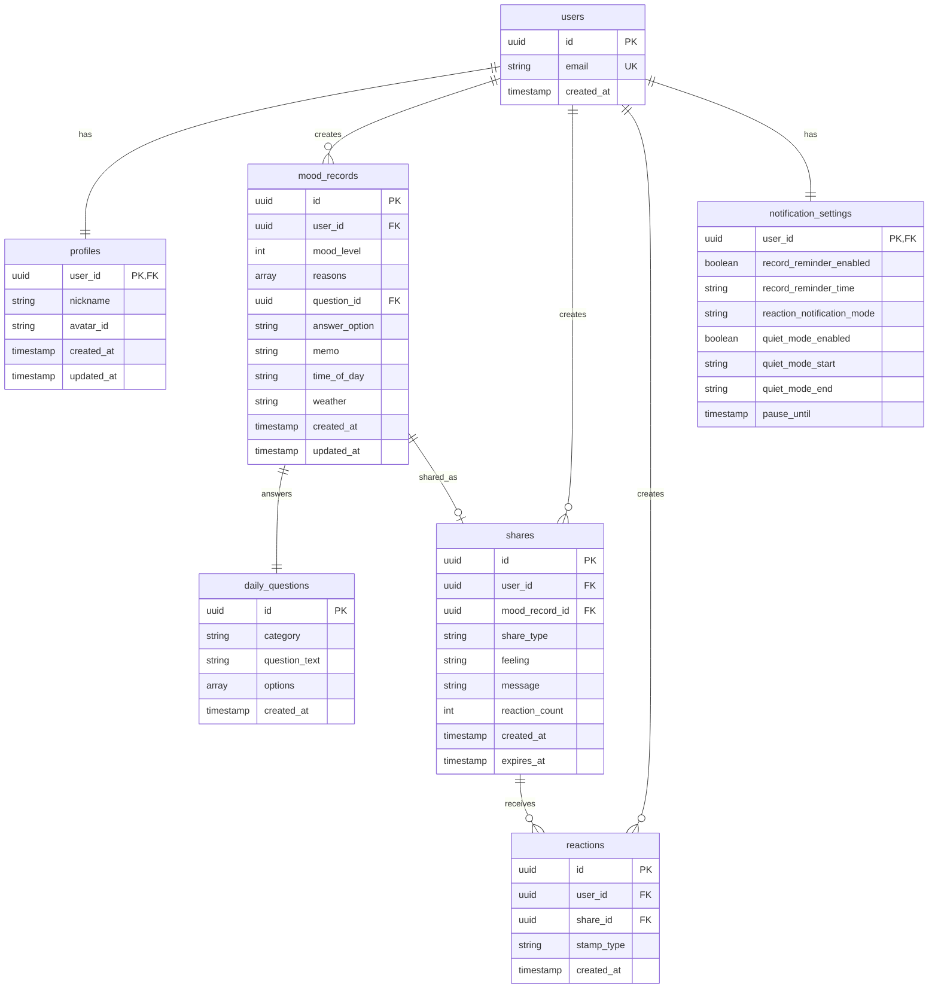

# 技術設計書

## 概要

**目的**: Mood Harbor（気分の港）は、文字入力なしでタップのみで感情を記録し、温かいコミュニティでユーザー同士が励まし合える学生向け感情記録PWAアプリケーションです。「10秒で完了」「文字入力ゼロ」「感情に特化」という3つの核となる価値を提供し、日記が続かないユーザーでも継続できる体験を実現します。

**ユーザー**: 学生を中心としたモバイルユーザーが、日々の感情記録、振り返り、コミュニティでの励まし合いに活用します。

**影響**: 新規アプリケーション開発。Next.js 16 + React 19 + Supabaseによるモダンなフルスタック構成で、PWA対応により既存Webとネイティブアプリのギャップを埋めます。

### ゴール

- タップのみで10秒以内に気分記録を完了できる直感的なUX実現
- リアルタイムコミュニティ機能（ハーバー）による温かいユーザー同士のつながり
- オフライン対応とPWA化によるモバイルファーストの体験提供
- セキュアな認証とプライバシー保護による安心できるサービス

### 非ゴール

- ネイティブモバイルアプリの開発（PWAで代替）
- AIによる感情分析や高度なレコメンデーション機能（将来的検討）
- 他サービスとのデータ統合（初期フェーズ外）
- エンタープライズ向け機能（組織管理、SAML SSOなど）

## アーキテクチャ

> 詳細な調査ノートは`research.md`に記録。設計書は自己完結的にレビュー可能なよう、すべての決定と契約をここに記載。

### アーキテクチャパターンと境界マップ

**選択パターン**: Server-First Architecture with Feature-Sliced Design

**ドメイン/機能境界**:
- **認証ドメイン**: ユーザー登録、ログイン、セッション管理、プロフィール設定
- **記録ドメイン**: 気分記録、日替わり質問、補足入力、カレンダー表示
- **分析ドメイン**: 週間サマリー、月間レポート、インサイト生成
- **コミュニティドメイン**: シェア投稿、ハーバー表示、応援機能、フィルター
- **通知ドメイン**: リマインダー、応援通知、週間サマリー配信
- **設定ドメイン**: プライバシー設定、通知設定、データエクスポート

**アーキテクチャ統合**:
- Next.js 16 App RouterによるServer-First設計、React Server Componentsでサーバー処理を優先
- SupabaseがAuth、Database、Realtime、Storageを統合提供
- Feature-Sliced Designでドメインごとにディレクトリ分離、並行開発と境界衝突を回避
- ZustandによるクライアントステートとServer Actionsによるサーバーステートの分離
- middlewareでグローバル認証チェックとルート保護を実装

**既存パターンの保持**:
- Next.js App Routerのファイルベースルーティング
- Tailwind CSSによるユーティリティファーストスタイリング
- TypeScript strict modeによる型安全性

**新規コンポーネント根拠**:
- PWA対応: モバイルユーザーのオフライン利用とホーム画面追加
- Realtime機能: ハーバーでの投稿と応援のリアルタイム更新
- データ同期ロジック: オフライン記録とオンライン復帰時の同期

**ステアリング準拠**:
- （ステアリングファイルが存在しないため、一般的なNext.js/React/TypeScriptベストプラクティスに準拠）



### 技術スタック

| レイヤー | 選択 / バージョン | 機能における役割 | 備考 |
|---------|------------------|-----------------|-------|
| Frontend | Next.js 16.1.1, React 19.2.3 | App Router、Server Components、Server Actions | 既存package.json準拠 |
| Frontend UI | TailwindCSS v4, Framer Motion (Motion) | レスポンシブデザイン、アニメーション | モバイルファースト、ダークモード準備 |
| Frontend State | Zustand (最新) | クライアントステート管理（認証状態、UI状態、記録データ） | 軽量、React 19互換 |
| Backend | Supabase (最新) | 認証、PostgreSQL、Realtime、Storage統合 | バックエンドプラットフォーム一元化 |
| Database | PostgreSQL (Supabase提供) | リレーショナルデータモデル、RLS | Row Level Securityで行単位アクセス制御 |
| Realtime | Supabase Realtime (Elixir) | WebSocket経由のリアルタイム更新 | ハーバー投稿・応援の即時反映 |
| PWA | @ducanh2912/next-pwa (最新) | Service Worker、manifest、オフライン対応 | Next.js App Router対応 |
| TypeScript | TypeScript 5.x (strict mode) | 型安全性、開発体験向上 | noImplicitAny、strictNullChecks有効 |
| Runtime | Node.js 20+ / Edge Runtime (Vercel) | サーバーレス実行環境 | middlewareとServer ActionsでEdge活用 |

> 詳細な技術選定根拠とトレードオフは`research.md`の「設計決定」セクション参照

## システムフロー

### 気分記録フロー（3ステップ）



**フロー決定ポイント**:
- 各ステップ完了時に自動遷移し、10秒以内完了を実現
- サーバー保存は全ステップ完了後に一括実行（ネットワークリクエスト削減）
- シェアはオプショナルで、記録とは別トランザクション

### 応援機能リアルタイムフロー



**フロー決定ポイント**:
- Supabase Realtimeで即座に反映、UXの温かさを向上
- 重複応援チェックはRLS + UNIQUE制約で実現
- 30秒以内取り消しはクライアント側タイムスタンプで制御

### オフライン同期フロー



**フロー決定ポイント**:
- Service WorkerがNetworkFirstで記録データを送信試行
- オフライン時はIndexedDBにキュー保存
- オンライン復帰時にService Worker background syncでリトライ

## 要件トレーサビリティ

| 要件 | 概要 | コンポーネント | インターフェース | フロー |
|------|------|--------------|----------------|--------|
| 1.1 | メール/パスワード登録 | AuthService, SignupForm | Supabase Auth API | 認証フロー |
| 1.2 | Google OAuth認証 | AuthService, OAuthButton | Supabase Auth API | 認証フロー |
| 1.3 | ログイン機能 | AuthService, LoginForm | Supabase Auth API | 認証フロー |
| 1.4 | アカウント削除 | AccountService, DeleteAccountAction | Supabase Auth/DB API | アカウント管理フロー |
| 1.5 | パスワードハッシュ化 | AuthService | Supabase Auth（bcrypt） | 認証フロー |
| 1.6 | HTTPS通信 | Next.js Server, Supabase | HTTPS | 全フロー |
| 2.1 | プロフィール設定画面 | ProfileSetupPage, ProfileForm | Profile API | プロフィール設定フロー |
| 2.2 | ニックネーム入力（10文字制限） | NicknameInput | Profile API | プロフィール設定フロー |
| 2.3 | アバター選択（30種類） | AvatarSelector | Profile API | プロフィール設定フロー |
| 2.4 | ランダムニックネーム生成 | NicknameGenerator | ユーティリティ関数 | プロフィール設定フロー |
| 2.5 | アバターカテゴリー分類 | AvatarCategoryView | Profile API | プロフィール設定フロー |
| 3.1 | 記録ボタンからステップ1表示 | RecordButton, MoodStepPage | UI State | 気分記録フロー |
| 3.2 | 気分選択と自動遷移 | MoodSelector | Mood Record API | 気分記録フロー |
| 3.3 | 理由カテゴリー選択（最大2） | ReasonSelector | Mood Record API | 気分記録フロー |
| 3.4 | 日替わり質問回答と完了 | QuestionAnswerSelector, RecordCompleteAction | Mood Record API | 気分記録フロー |
| 3.5 | 15秒以内の設計 | 全記録UIコンポーネント | フロントエンド最適化 | 気分記録フロー |
| 3.6 | 完了アニメーション | RecordCompleteAnimation | Framer Motion | 気分記録フロー |
| 3.7 | 5段階気分レベル | MoodSelector | Mood Record API | 気分記録フロー |
| 3.8 | 8つの理由カテゴリー | ReasonSelector | Mood Record API | 気分記録フロー |
| 4.1-4.6 | 日替わり質問機能 | DailyQuestionService, QuestionSelector | Daily Question API | 気分記録フロー |
| 5.1-5.6 | 補足入力（メモ、時間帯、天気） | SupplementForm | Mood Record API | 補足入力フロー |
| 6.1-6.8 | カレンダー表示・詳細・編集 | CalendarView, RecordDetailModal | Calendar API | カレンダー表示フロー |
| 7.1-7.5 | 週間サマリー通知 | WeeklySummaryService, NotificationService | Summary API, Notification API | 週間サマリーフロー |
| 8.1-8.6 | 月間レポート | MonthlyReportPage | Report API | レポート表示フロー |
| 9.1-9.5 | インサイト機能 | InsightService | Insight API | インサイト生成フロー |
| 10.1-10.12 | シェア機能 | ShareForm, ShareTypeSelector | Share API | シェア投稿フロー |
| 11.1-11.9 | ハーバー（タイムライン） | HarborPage, PostCard | Harbor API, Realtime | ハーバー表示フロー |
| 12.1-12.3 | フィルター機能 | FilterModal | Harbor API | ハーバーフィルターフロー |
| 13.1-13.10 | 応援・リアクション | ReactionButton, StampSelector | Reaction API, Realtime | 応援フロー |
| 14.1-14.7 | 通知機能 | NotificationService, PushService | Notification API, Push API | 通知配信フロー |
| 15.1-15.5 | プライバシー設定 | PrivacySettingsPage | Settings API | プライバシー管理フロー |
| 16.1-16.4 | データエクスポート | ExportService | Export API | データエクスポートフロー |
| 17.1-17.5 | オンボーディング | OnboardingPage, Tutorial | Onboarding API | オンボーディングフロー |
| 18.1-18.4 | パフォーマンス要件 | 全コンポーネント | Next.js最適化、Edge Runtime | 全フロー |
| 19.1-19.6 | セキュリティ要件 | AuthService, Middleware, Supabase RLS | 認証・認可機能 | 全フロー |
| 20.1-20.4 | 可用性・スケーラビリティ | Supabase、Vercel | インフラ | 全フロー |
| 21.1-21.5 | アクセシビリティ要件 | 全UIコンポーネント | ARIA属性、レスポンシブ | 全フロー |

## コンポーネントとインターフェース

### コンポーネント概要

| コンポーネント | ドメイン/レイヤー | 目的 | 要件カバレッジ | 主要依存関係（優先度） | 契約 |
|-------------|----------------|------|--------------|----------------------|------|
| AuthService | Backend/Auth | 認証・認可処理 | 1.1-1.6 | Supabase Auth (P0) | Service |
| ProfileService | Backend/Profile | プロフィール管理 | 2.1-2.5 | Supabase DB (P0) | Service, API |
| MoodRecordService | Backend/Record | 気分記録CRUD | 3.1-3.8, 5.1-5.6 | Supabase DB (P0), DailyQuestionService (P1) | Service, API |
| DailyQuestionService | Backend/Record | 日替わり質問提供 | 4.1-4.6 | Supabase DB (P0) | Service |
| ShareService | Backend/Community | シェア投稿管理 | 10.1-10.12 | Supabase DB (P0), Realtime (P0) | Service, API, Event |
| HarborService | Backend/Community | ハーバーフィード取得 | 11.1-11.9, 12.1-12.3 | Supabase DB (P0), Realtime (P0) | Service, API, Event |
| ReactionService | Backend/Community | 応援機能 | 13.1-13.10 | Supabase DB (P0), Realtime (P0) | Service, API, Event |
| NotificationService | Backend/Notification | 通知配信 | 14.1-14.7 | Web Push API (P0), Supabase DB (P1) | Service, API |
| SummaryService | Backend/Analytics | サマリー生成 | 7.1-7.5, 8.1-8.6 | Supabase DB (P0) | Service, API |
| InsightService | Backend/Analytics | インサイト生成 | 9.1-9.5 | Supabase DB (P0) | Service |
| ExportService | Backend/Settings | データエクスポート | 16.1-16.4 | Supabase DB (P0) | Service |
| PWAService | Frontend/PWA | Service Worker、同期 | 18.1-18.4 | IndexedDB (P0), Sync API (P1) | Service, Batch |
| MoodRecordStore | Frontend/State | 記録状態管理 | 3.1-3.8 | Zustand (P0) | State |
| AuthStore | Frontend/State | 認証状態管理 | 1.1-1.6 | Zustand (P0) | State |
| RecordPage | Frontend/UI | 記録画面 | 3.1-3.8, 4.1-4.6 | MoodRecordStore (P0), MoodRecordService (P0) | UI |
| HarborPage | Frontend/UI | ハーバー画面 | 11.1-11.9 | HarborService (P0), Realtime (P0) | UI, Event |
| CalendarPage | Frontend/UI | カレンダー画面 | 6.1-6.8 | MoodRecordService (P0) | UI |

### 認証ドメイン

#### AuthService

| フィールド | 詳細 |
|---------|--------|
| 目的 | ユーザー認証・認可処理の一元管理 |
| 要件 | 1.1, 1.2, 1.3, 1.4, 1.5, 1.6 |
| オーナー/レビュアー | Backend開発担当 |

**責務と制約**
- ユーザー登録、ログイン、ログアウト、セッション管理
- OAuth認証フローの開始と完了処理
- パスワードハッシュ化はSupabase Authに委譲
- トランザクション境界: 認証リクエスト単位

**依存関係**
- Outbound: Supabase Auth API — 認証処理 (P0 - 認証の中核)
- External: Google OAuth Provider — OAuth認証 (P1 - OAuth必須時)

**契約**: Service [x] / API [ ] / Event [ ] / Batch [ ] / State [ ]

##### Service Interface

```typescript
interface AuthService {
  signUp(params: SignUpParams): Promise<Result<User, AuthError>>;
  signIn(params: SignInParams): Promise<Result<Session, AuthError>>;
  signInWithOAuth(provider: OAuthProvider): Promise<Result<Session, AuthError>>;
  signOut(): Promise<Result<void, AuthError>>;
  getCurrentUser(): Promise<Result<User | null, AuthError>>;
  deleteAccount(userId: string): Promise<Result<void, AuthError>>;
}

type SignUpParams = {
  email: string;
  password: string;
};

type SignInParams = {
  email: string;
  password: string;
};

type OAuthProvider = 'google';

type User = {
  id: string;
  email: string;
  created_at: string;
};

type Session = {
  access_token: string;
  refresh_token: string;
  user: User;
};

type AuthError =
  | { type: 'INVALID_CREDENTIALS' }
  | { type: 'EMAIL_ALREADY_EXISTS' }
  | { type: 'WEAK_PASSWORD' }
  | { type: 'NETWORK_ERROR' };
```

- 事前条件: signUpはメールアドレス形式とパスワード強度がバリデーション済み、deleteAccountは認証済みユーザーのみ
- 事後条件: signUp成功時にユーザーレコード作成、signIn成功時にセッション確立
- 不変条件: パスワードは平文で保存されない

**実装ノート**
- 統合: Supabase Auth SDKの`auth.signUp()`, `auth.signInWithPassword()`, `auth.signInWithOAuth()`を使用
- 検証: パスワード強度チェック（8文字以上、英数字混在）をクライアント側とサーバー側の両方で実施
- リスク: OAuth認証時のリダイレクトURLミス設定によるCSRF脆弱性 — Supabase設定で許可URLを明示的に登録

#### ProfileService

| フィールド | 詳細 |
|---------|--------|
| 目的 | ユーザープロフィール情報の管理 |
| 要件 | 2.1, 2.2, 2.3, 2.4, 2.5 |

**責務と制約**
- ニックネーム、アバター設定の保存と更新
- ランダムニックネーム生成ロジック
- トランザクション境界: プロフィール更新リクエスト単位

**依存関係**
- Outbound: Supabase DB — profilesテーブルへのCRUD (P0)

**契約**: Service [x] / API [x] / Event [ ] / Batch [ ] / State [ ]

##### Service Interface

```typescript
interface ProfileService {
  createProfile(params: CreateProfileParams): Promise<Result<Profile, ProfileError>>;
  updateProfile(userId: string, updates: UpdateProfileParams): Promise<Result<Profile, ProfileError>>;
  getProfile(userId: string): Promise<Result<Profile | null, ProfileError>>;
  generateRandomNickname(): string;
}

type CreateProfileParams = {
  user_id: string;
  nickname: string;
  avatar_id: string;
};

type UpdateProfileParams = Partial<Omit<CreateProfileParams, 'user_id'>>;

type Profile = {
  user_id: string;
  nickname: string;
  avatar_id: string;
  created_at: string;
  updated_at: string;
};

type ProfileError =
  | { type: 'NICKNAME_TOO_LONG'; max: number }
  | { type: 'AVATAR_NOT_FOUND'; avatar_id: string }
  | { type: 'PROFILE_NOT_FOUND'; user_id: string };
```

- 事前条件: nicknameは10文字以内、avatar_idは有効なアバターIDリストに含まれる
- 事後条件: プロフィール作成または更新成功時にprofilesテーブル更新
- 不変条件: 1ユーザーに1プロフィールのみ（user_id UNIQUE制約）

##### API Contract

| メソッド | エンドポイント | リクエスト | レスポンス | エラー |
|--------|----------|---------|----------|--------|
| POST | /api/profile | CreateProfileRequest | Profile | 400, 409, 500 |
| PATCH | /api/profile/:userId | UpdateProfileRequest | Profile | 400, 404, 500 |
| GET | /api/profile/:userId | - | Profile | 404, 500 |

```typescript
type CreateProfileRequest = {
  nickname: string;
  avatar_id: string;
};

type UpdateProfileRequest = Partial<CreateProfileRequest>;
```

**実装ノート**
- 統合: Supabase DBの`profiles`テーブルへServer Actionsでアクセス
- 検証: nicknameの文字数制限と不適切語フィルタリング、avatar_idのホワイトリストチェック
- リスク: ニックネーム重複による混乱 — 初期は許容、将来的にユニーク制約追加を検討

### 記録ドメイン

#### MoodRecordService

| フィールド | 詳細 |
|---------|--------|
| 目的 | 気分記録のCRUD処理と関連データ管理 |
| 要件 | 3.1, 3.2, 3.3, 3.4, 3.5, 3.6, 3.7, 3.8, 5.1, 5.2, 5.3, 5.4, 5.5, 5.6 |

**責務と制約**
- 気分記録の作成、取得、更新、削除
- 理由カテゴリー、日替わり質問回答、補足情報の関連付け
- トランザクション境界: 1記録の作成・更新単位

**依存関係**
- Outbound: Supabase DB — mood_recordsテーブルCRUD (P0)
- Inbound: RecordPage, CalendarPage — 記録データ取得 (P0)
- Outbound: DailyQuestionService — 当日の質問取得 (P1)

**契約**: Service [x] / API [x] / Event [ ] / Batch [ ] / State [ ]

##### Service Interface

```typescript
interface MoodRecordService {
  createRecord(params: CreateRecordParams): Promise<Result<MoodRecord, RecordError>>;
  updateRecord(recordId: string, updates: UpdateRecordParams): Promise<Result<MoodRecord, RecordError>>;
  getRecord(recordId: string): Promise<Result<MoodRecord | null, RecordError>>;
  getRecordsByUser(userId: string, filters?: RecordFilters): Promise<Result<MoodRecord[], RecordError>>;
  deleteRecord(recordId: string): Promise<Result<void, RecordError>>;
}

type MoodLevel = 1 | 2 | 3 | 4 | 5; // 1: とても疲れた, 5: とても良い

type ReasonCategory =
  | 'study_school'
  | 'relationships'
  | 'health'
  | 'hobbies'
  | 'work'
  | 'family'
  | 'sleep'
  | 'no_reason';

type TimeOfDay = 'morning' | 'afternoon' | 'evening' | 'night';
type Weather = 'sunny' | 'cloudy' | 'rainy' | 'other';

type CreateRecordParams = {
  user_id: string;
  mood_level: MoodLevel;
  reasons: ReasonCategory[]; // max 2
  question_id: string;
  answer_option: string;
  memo?: string; // max 10 chars
  time_of_day?: TimeOfDay;
  weather?: Weather;
};

type UpdateRecordParams = Partial<Omit<CreateRecordParams, 'user_id' | 'question_id'>>;

type MoodRecord = {
  id: string;
  user_id: string;
  mood_level: MoodLevel;
  reasons: ReasonCategory[];
  question_id: string;
  answer_option: string;
  memo: string | null;
  time_of_day: TimeOfDay | null;
  weather: Weather | null;
  created_at: string;
  updated_at: string;
};

type RecordFilters = {
  start_date?: string;
  end_date?: string;
  mood_levels?: MoodLevel[];
};

type RecordError =
  | { type: 'INVALID_MOOD_LEVEL'; level: number }
  | { type: 'TOO_MANY_REASONS'; max: number }
  | { type: 'MEMO_TOO_LONG'; max: number }
  | { type: 'RECORD_NOT_FOUND'; record_id: string };
```

- 事前条件: mood_levelは1-5、reasonsは最大2つ、memoは10文字以内
- 事後条件: 記録作成時にmood_recordsテーブル挿入、created_at自動設定
- 不変条件: user_idとcreated_atの組み合わせで日次ユニーク制約（1日1記録推奨だが強制はしない）

##### API Contract

| メソッド | エンドポイント | リクエスト | レスポンス | エラー |
|--------|----------|---------|----------|--------|
| POST | /api/records | CreateRecordRequest | MoodRecord | 400, 500 |
| PATCH | /api/records/:recordId | UpdateRecordRequest | MoodRecord | 400, 404, 500 |
| GET | /api/records/:recordId | - | MoodRecord | 404, 500 |
| GET | /api/records/user/:userId | RecordFiltersQuery | MoodRecord[] | 400, 500 |
| DELETE | /api/records/:recordId | - | void | 404, 500 |

**実装ノート**
- 統合: Server Actionsで`mood_records`テーブルへアクセス、DailyQuestionServiceから当日の質問IDを取得
- 検証: reasons配列の長さチェック、memoのサニタイゼーション、XSS対策
- リスク: 1日複数記録への対応 — 初期は最新のみカレンダー表示、将来的に複数表示対応

#### DailyQuestionService

| フィールド | 詳細 |
|---------|--------|
| 目的 | 日替わり質問の提供とロジック管理 |
| 要件 | 4.1, 4.2, 4.3, 4.4, 4.5, 4.6 |

**責務と制約**
- 当日の日替わり質問を曜日・カテゴリーに応じて返却
- 質問マスターデータの管理
- トランザクション境界: 質問取得リクエスト単位

**依存関係**
- Outbound: Supabase DB — daily_questionsテーブル読み取り (P0)
- Inbound: MoodRecordService — 記録時に質問取得 (P0)

**契約**: Service [x] / API [ ] / Event [ ] / Batch [ ] / State [ ]

##### Service Interface

```typescript
interface DailyQuestionService {
  getTodayQuestion(): Promise<Result<DailyQuestion, QuestionError>>;
  getQuestionById(questionId: string): Promise<Result<DailyQuestion | null, QuestionError>>;
}

type QuestionCategory =
  | 'connection'
  | 'activity'
  | 'achievement'
  | 'feeling'
  | 'weekend'
  | 'sunday';

type DailyQuestion = {
  id: string;
  category: QuestionCategory;
  question_text: string;
  options: string[]; // 3-4 options
  created_at: string;
};

type QuestionError =
  | { type: 'NO_QUESTION_FOR_TODAY' }
  | { type: 'QUESTION_NOT_FOUND'; question_id: string };
```

- 事前条件: daily_questionsテーブルに質問データが登録済み
- 事後条件: 曜日に応じた質問を返却（金曜・土曜はweekend、日曜はsunday、それ以外はカテゴリーローテーション）
- 不変条件: 各質問には3-4の選択肢が必須

**実装ノート**
- 統合: Supabase DBから質問データを取得、曜日判定ロジックはサーバーサイドで実装
- 検証: 質問テキストと選択肢のサニタイゼーション
- リスク: 質問データ不足 — 初期は手動登録、将来的にCMS統合やAI生成検討

### コミュニティドメイン

#### ShareService

| フィールド | 詳細 |
|---------|--------|
| 目的 | シェア投稿の作成と管理 |
| 要件 | 10.1, 10.2, 10.3, 10.4, 10.5, 10.6, 10.7, 10.8, 10.9, 10.10, 10.11, 10.12 |

**責務と制約**
- シェア投稿の作成、取得、削除
- 24時間後の自動削除処理
- プライバシー設定に応じた公開範囲制御
- トランザクション境界: 1投稿の作成・削除単位

**依存関係**
- Outbound: Supabase DB — sharesテーブルCRUD (P0)
- Outbound: Supabase Realtime — 新規投稿通知 (P0)
- Inbound: HarborPage — ハーバーフィード表示 (P0)

**契約**: Service [x] / API [x] / Event [x] / Batch [ ] / State [ ]

##### Service Interface

```typescript
interface ShareService {
  createShare(params: CreateShareParams): Promise<Result<Share, ShareError>>;
  getShare(shareId: string): Promise<Result<Share | null, ShareError>>;
  deleteShare(shareId: string, userId: string): Promise<Result<void, ShareError>>;
}

type ShareType = 'support_needed' | 'joy_share' | 'achievement';

type Feeling = string; // ShareTypeごとに異なる選択肢

type CreateShareParams = {
  user_id: string;
  mood_record_id: string;
  share_type: ShareType;
  feeling: Feeling;
  message?: string; // max 10 chars
};

type Share = {
  id: string;
  user_id: string;
  mood_record_id: string;
  share_type: ShareType;
  feeling: Feeling;
  message: string | null;
  reaction_count: number;
  created_at: string;
  expires_at: string; // created_at + 24 hours
};

type ShareError =
  | { type: 'MESSAGE_TOO_LONG'; max: number }
  | { type: 'PRIVACY_SETTINGS_DISABLED' }
  | { type: 'SHARE_NOT_FOUND'; share_id: string }
  | { type: 'UNAUTHORIZED_DELETE' };
```

- 事前条件: user_idは認証済み、mood_record_idは存在する記録ID、messageは10文字以内
- 事後条件: shares作成時にexpires_atが自動設定（created_at + 24時間）、Realtime通知配信
- 不変条件: 1つの気分記録に対して複数シェアは許可（記録後に再シェアも可能）

##### API Contract

| メソッド | エンドポイント | リクエスト | レスポンス | エラー |
|--------|----------|---------|----------|--------|
| POST | /api/shares | CreateShareRequest | Share | 400, 403, 500 |
| GET | /api/shares/:shareId | - | Share | 404, 500 |
| DELETE | /api/shares/:shareId | - | void | 403, 404, 500 |

##### Event Contract

- Published events:
  - `share:created` — 新規シェア投稿時にハーバーへブロードキャスト
  - `share:deleted` — シェア削除時（24時間経過または手動削除）
- Subscribed events: なし
- Ordering / delivery guarantees: Supabase Realtimeによるat-least-once配信、順序保証なし（タイムスタンプでクライアント側ソート）

**実装ノート**
- 統合: Supabase Realtimeの`channel.send()`で新規投稿をブロードキャスト、RLSでプライバシー設定反映
- 検証: messageのXSS対策、share_typeとfeelingの組み合わせバリデーション
- リスク: 24時間後の自動削除 — Supabase Functionまたはcronジョブで実装、削除前に通知配信

#### HarborService

| フィールド | 詳細 |
|---------|--------|
| 目的 | ハーバー（タイムライン）のフィード取得とフィルタリング |
| 要件 | 11.1, 11.2, 11.3, 11.4, 11.5, 11.6, 11.7, 11.8, 11.9, 12.1, 12.2, 12.3 |

**責務と制約**
- ハーバーフィードの取得（シェア種類別タブ）
- フィルター適用（時間帯、応援数順）
- 24時間以内の投稿のみ表示
- トランザクション境界: フィード取得リクエスト単位

**依存関係**
- Outbound: Supabase DB — sharesテーブル読み取り（JOINでprofiles取得） (P0)
- Outbound: Supabase Realtime — リアルタイム更新購読 (P0)
- Inbound: HarborPage — フィード表示 (P0)

**契約**: Service [x] / API [x] / Event [x] / Batch [ ] / State [ ]

##### Service Interface

```typescript
interface HarborService {
  getFeed(filters: HarborFilters): Promise<Result<HarborPost[], HarborError>>;
  subscribeToFeed(shareType: ShareType, callback: (post: HarborPost) => void): () => void;
}

type HarborFilters = {
  share_type: ShareType;
  time_of_day?: TimeOfDay;
  sort_by?: 'newest' | 'most_reactions';
  limit?: number;
  offset?: number;
};

type HarborPost = {
  share: Share;
  user: {
    nickname: string;
    avatar_id: string;
  };
  reactions: {
    count: number;
    user_reacted: boolean;
  };
};

type HarborError =
  | { type: 'INVALID_FILTERS' };
```

- 事前条件: share_typeは有効な値、limitは1-100
- 事後条件: 24時間以内のシェア投稿を返却、sort_byに応じてソート
- 不変条件: expires_at < 現在時刻の投稿は返却しない

##### API Contract

| メソッド | エンドポイント | リクエスト | レスポンス | エラー |
|--------|----------|---------|----------|--------|
| GET | /api/harbor | HarborFiltersQuery | HarborPost[] | 400, 500 |

##### Event Contract

- Published events: なし
- Subscribed events:
  - `share:created` — 新規シェア投稿をリアルタイムで受信
  - `reaction:added` — 応援追加をリアルタイムで受信
  - `reaction:removed` — 応援削除をリアルタイムで受信
- Ordering / delivery guarantees: Supabase Realtimeによるat-least-once配信

**実装ノート**
- 統合: Supabase DBのJOINクエリで`shares`と`profiles`を結合、Realtimeチャンネルで購読
- 検証: フィルター値のホワイトリストチェック
- リスク: 大量投稿時のパフォーマンス — ページネーション必須、無限スクロールで対応

#### ReactionService

| フィールド | 詳細 |
|---------|--------|
| 目的 | 応援機能の管理とリアルタイム反映 |
| 要件 | 13.1, 13.2, 13.3, 13.4, 13.5, 13.6, 13.7, 13.8, 13.9, 13.10 |

**責務と制約**
- 応援の追加と削除（30秒以内取り消し）
- 重複応援防止と自己応援防止
- 応援通知の配信
- トランザクション境界: 1応援の追加・削除単位

**依存関係**
- Outbound: Supabase DB — reactionsテーブルCRUD (P0)
- Outbound: Supabase Realtime — 応援イベント配信 (P0)
- Outbound: NotificationService — 応援通知送信 (P1)

**契約**: Service [x] / API [x] / Event [x] / Batch [ ] / State [ ]

##### Service Interface

```typescript
interface ReactionService {
  addReaction(params: AddReactionParams): Promise<Result<Reaction, ReactionError>>;
  removeReaction(reactionId: string, userId: string): Promise<Result<void, ReactionError>>;
  getReactionsByShare(shareId: string): Promise<Result<Reaction[], ReactionError>>;
}

type StampType = string; // ShareTypeごとに異なるスタンプ（6種類）

type AddReactionParams = {
  user_id: string;
  share_id: string;
  stamp_type: StampType;
};

type Reaction = {
  id: string;
  user_id: string;
  share_id: string;
  stamp_type: StampType;
  created_at: string;
};

type ReactionError =
  | { type: 'DUPLICATE_REACTION' }
  | { type: 'SELF_REACTION_NOT_ALLOWED' }
  | { type: 'CANCEL_TIMEOUT_EXCEEDED'; max_seconds: number }
  | { type: 'REACTION_NOT_FOUND'; reaction_id: string };
```

- 事前条件: user_idは認証済み、share_idは存在する投稿ID、stamp_typeは有効な値
- 事後条件: 応援追加時にreactionsテーブル挿入、Realtime配信、sharesのreaction_count更新
- 不変条件: (user_id, share_id) UNIQUE制約で重複防止

##### API Contract

| メソッド | エンドポイント | リクエスト | レスポンス | エラー |
|--------|----------|---------|----------|--------|
| POST | /api/reactions | AddReactionRequest | Reaction | 400, 409, 500 |
| DELETE | /api/reactions/:reactionId | - | void | 403, 404, 500 |
| GET | /api/reactions/share/:shareId | - | Reaction[] | 404, 500 |

##### Event Contract

- Published events:
  - `reaction:added` — 応援追加時に投稿者とハーバー購読者へ配信
  - `reaction:removed` — 応援削除時に投稿者とハーバー購読者へ配信
- Subscribed events: なし
- Ordering / delivery guarantees: Supabase Realtimeによるat-least-once配信

**実装ノート**
- 統合: Supabase Realtimeで`reaction:added`イベント配信、NotificationServiceで通知送信
- 検証: 自己応援チェック（user_id !== share.user_id）、重複チェック（UNIQUE制約）
- リスク: 30秒取り消し制限 — クライアント側タイムスタンプで制御、サーバー側でも検証

### 通知ドメイン

#### NotificationService

| フィールド | 詳細 |
|---------|--------|
| 目的 | 通知の配信と管理 |
| 要件 | 14.1, 14.2, 14.3, 14.4, 14.5, 14.6, 14.7 |

**責務と制約**
- プッシュ通知の送信（記録リマインダー、応援通知、週間サマリー）
- 通知設定の管理（リアルタイム/まとめ、おやすみモード、一時停止）
- トランザクション境界: 通知送信リクエスト単位

**依存関係**
- Outbound: Web Push API — プッシュ通知配信 (P0)
- Outbound: Supabase DB — notification_settingsテーブル読み取り (P1)
- Inbound: ReactionService, SummaryService — 通知トリガー (P0)

**契約**: Service [x] / API [x] / Event [ ] / Batch [ ] / State [ ]

##### Service Interface

```typescript
interface NotificationService {
  sendNotification(params: SendNotificationParams): Promise<Result<void, NotificationError>>;
  getNotificationSettings(userId: string): Promise<Result<NotificationSettings, NotificationError>>;
  updateNotificationSettings(userId: string, updates: Partial<NotificationSettings>): Promise<Result<NotificationSettings, NotificationError>>;
}

type NotificationType = 'record_reminder' | 'reaction_realtime' | 'reaction_summary' | 'weekly_summary' | 'streak_reminder';

type SendNotificationParams = {
  user_id: string;
  type: NotificationType;
  title: string;
  body: string;
  data?: Record<string, unknown>;
};

type NotificationSettings = {
  user_id: string;
  record_reminder_enabled: boolean;
  record_reminder_time: string; // HH:MM format, default "21:00"
  reaction_notification_mode: 'realtime' | 'summary' | 'off';
  quiet_mode_enabled: boolean;
  quiet_mode_start: string | null; // HH:MM
  quiet_mode_end: string | null; // HH:MM
  pause_until: string | null; // ISO timestamp
};

type NotificationError =
  | { type: 'PUSH_SUBSCRIPTION_NOT_FOUND'; user_id: string }
  | { type: 'NOTIFICATION_DISABLED'; notification_type: NotificationType };
```

- 事前条件: user_idは有効、通知設定で該当通知が有効
- 事後条件: Web Push API経由で通知配信、おやすみモード時は配信スキップ
- 不変条件: 一時停止中は全通知を配信しない

##### API Contract

| メソッド | エンドポイント | リクエスト | レスポンス | エラー |
|--------|----------|---------|----------|--------|
| POST | /api/notifications/send | SendNotificationRequest | void | 400, 404, 500 |
| GET | /api/notifications/settings/:userId | - | NotificationSettings | 404, 500 |
| PATCH | /api/notifications/settings/:userId | UpdateNotificationSettingsRequest | NotificationSettings | 400, 404, 500 |

**実装ノート**
- 統合: Web Push APIで通知送信、Supabase Functionまたはcronで定期実行（記録リマインダー、週間サマリー）
- 検証: 通知設定の有効性チェック、おやすみモード時間帯の判定
- リスク: プッシュ通知の許可拒否 — ユーザーへの説明UIとin-app通知へのフォールバック

### PWAとオフライン同期

#### PWAService

| フィールド | 詳細 |
|---------|--------|
| 目的 | Service Worker管理とオフライン同期 |
| 要件 | 18.1, 18.2, 18.3, 18.4 |

**責務と制約**
- Service Workerのライフサイクル管理
- オフライン時の記録データのIndexedDB保存
- オンライン復帰時の同期処理
- トランザクション境界: 同期バッチ単位

**依存関係**
- Outbound: IndexedDB — オフラインデータ保存 (P0)
- Outbound: Sync API — バックグラウンド同期 (P1)
- Inbound: 全UI — オフライン対応 (P0)

**契約**: Service [x] / API [ ] / Event [ ] / Batch [x] / State [ ]

##### Service Interface

```typescript
interface PWAService {
  registerServiceWorker(): Promise<Result<ServiceWorkerRegistration, PWAError>>;
  cacheRecord(record: OfflineRecord): Promise<Result<void, PWAError>>;
  syncOfflineRecords(): Promise<Result<SyncResult, PWAError>>;
  clearCache(): Promise<Result<void, PWAError>>;
}

type OfflineRecord = {
  temp_id: string;
  data: CreateRecordParams;
  created_at: string;
};

type SyncResult = {
  synced_count: number;
  failed_count: number;
  errors: RecordError[];
};

type PWAError =
  | { type: 'SERVICE_WORKER_REGISTRATION_FAILED' }
  | { type: 'INDEXEDDB_NOT_AVAILABLE' }
  | { type: 'SYNC_FAILED'; errors: RecordError[] };
```

- 事前条件: ブラウザがService WorkerとIndexedDBをサポート
- 事後条件: オフライン記録がIndexedDBに保存され、オンライン復帰時に同期キューへ追加
- 不変条件: 同期完了後はIndexedDBからデータ削除

##### Batch / Job Contract

- トリガー: オンライン復帰時（`online`イベント）またはバックグラウンド同期タイミング
- 入力 / 検証: IndexedDBから未同期レコードを取得、バリデーション済みデータのみ送信
- 出力 / 送信先: Supabase DBへServer Actions経由で送信
- 冪等性 & 復旧: temp_idで重複チェック、失敗時はリトライキューへ再追加

**実装ノート**
- 統合: @ducanh2912/next-pwaでService Worker生成、IndexedDBでオフラインキュー管理
- 検証: 同期前にデータ整合性チェック、サーバーサイドでも再検証
- リスク: IndexedDB容量制限 — 上限監視とユーザーへの警告、古いデータの自動削除

### フロントエンド状態管理

#### MoodRecordStore

| フィールド | 詳細 |
|---------|--------|
| 目的 | 記録フォームの状態管理 |
| 要件 | 3.1, 3.2, 3.3, 3.4, 3.5, 3.6, 3.7, 3.8 |

**責務と制約**
- 記録ステップ進行状態の管理
- 入力データの一時保存
- トランザクション境界: UIセッション単位

**依存関係**
- Inbound: RecordPage — 記録フォーム (P0)

**契約**: Service [ ] / API [ ] / Event [ ] / Batch [ ] / State [x]

##### State Management

- State model:

```typescript
type RecordFormState = {
  currentStep: 1 | 2 | 3;
  moodLevel: MoodLevel | null;
  selectedReasons: ReasonCategory[];
  questionId: string | null;
  answerOption: string | null;
  memo: string;
  timeOfDay: TimeOfDay | null;
  weather: Weather | null;
  isSubmitting: boolean;
  error: RecordError | null;
};

type RecordStoreActions = {
  setMoodLevel: (level: MoodLevel) => void;
  toggleReason: (reason: ReasonCategory) => void;
  setAnswer: (option: string) => void;
  setMemo: (text: string) => void;
  setTimeOfDay: (time: TimeOfDay) => void;
  setWeather: (weather: Weather) => void;
  nextStep: () => void;
  resetForm: () => void;
  submitRecord: () => Promise<void>;
};
```

- 永続化 & 一貫性: Zustandの`persist`ミドルウェアでlocalStorageに保存、フォーム未完成時のリロード復元
- 並行処理戦略: 単一ユーザーのフォーム入力のため排他制御不要

**実装ノート**
- 統合: Zustand storeでフォーム状態管理、Server Actionsで送信
- 検証: 各ステップでバリデーション実施、エラーメッセージ表示
- リスク: フォーム途中での離脱 — persist機能で復元、再開時に確認ダイアログ表示

#### AuthStore

| フィールド | 詳細 |
|---------|--------|
| 目的 | 認証状態の管理 |
| 要件 | 1.1, 1.2, 1.3, 1.4, 1.5, 1.6 |

**責務と制約**
- 現在のユーザー情報とセッション状態の管理
- ログイン/ログアウトアクションのトリガー
- トランザクション境界: 認証セッション単位

**依存関係**
- Inbound: 全UIコンポーネント — 認証状態参照 (P0)
- Outbound: AuthService — 認証処理 (P0)

**契約**: Service [ ] / API [ ] / Event [ ] / Batch [ ] / State [x]

##### State Management

- State model:

```typescript
type AuthState = {
  user: User | null;
  session: Session | null;
  isLoading: boolean;
  error: AuthError | null;
};

type AuthStoreActions = {
  signUp: (params: SignUpParams) => Promise<void>;
  signIn: (params: SignInParams) => Promise<void>;
  signInWithOAuth: (provider: OAuthProvider) => Promise<void>;
  signOut: () => Promise<void>;
  refreshSession: () => Promise<void>;
  clearError: () => void;
};
```

- 永続化 & 一貫性: Supabase AuthがセッションをlocalStorageに自動保存、リフレッシュトークンで自動更新
- 並行処理戦略: Supabase Auth SDKが並行リクエストを処理、Zustand storeはSDKの状態を反映

**実装ノート**
- 統合: Supabase Auth SDKとZustand storeを連携、セッション変更をリアルタイム反映
- 検証: トークン有効性チェック、期限切れ時の自動ログアウト
- リスク: セッション乗っ取り — HTTPSのみ、CSRF対策、Supabase Auth設定でセキュリティ強化

## データモデル

### ドメインモデル

**アグリゲートとトランザクション境界**:
- **ユーザーアグリゲート**: User + Profile（1対1）
- **記録アグリゲート**: MoodRecord + DailyQuestion（多対1）
- **シェアアグリゲート**: Share + MoodRecord（多対1）
- **応援アグリゲート**: Reaction + Share（多対1）

**エンティティ、値オブジェクト、ドメインイベント**:
- エンティティ: User, Profile, MoodRecord, DailyQuestion, Share, Reaction
- 値オブジェクト: MoodLevel, ReasonCategory, ShareType, Feeling, StampType
- ドメインイベント: ShareCreated, ShareDeleted, ReactionAdded, ReactionRemoved

**ビジネスルールと不変条件**:
- 1ユーザーに1プロフィール
- 記録の理由は最大2つ
- シェアは24時間後に自動削除
- 応援は(user_id, share_id)の組み合わせでユニーク
- 自己応援不可

### 論理データモデル

**構造定義**:



**カーディナリティと参照整合性**:
- users 1 - profiles 1
- users 1 - mood_records N
- users 1 - shares N
- users 1 - reactions N
- mood_records N - daily_questions 1
- mood_records 1 - shares 0..1（1記録から複数シェア可能だが通常1つ）
- shares 1 - reactions N
- users 1 - notification_settings 1

**整合性と完全性**:
- トランザクション境界: 各アグリゲート単位
- カスケードルール: usersテーブル削除時に関連データ全削除（CASCADE）
- 時間的側面: mood_recordsとsharesにcreated_at、updated_at自動設定

### 物理データモデル（PostgreSQL）

**テーブル定義とインデックス**:

```sql
-- users: Supabase Authで管理
-- auth.usersテーブルを使用

-- profiles
CREATE TABLE profiles (
  user_id UUID PRIMARY KEY REFERENCES auth.users(id) ON DELETE CASCADE,
  nickname VARCHAR(10) NOT NULL,
  avatar_id VARCHAR(50) NOT NULL,
  created_at TIMESTAMPTZ DEFAULT NOW(),
  updated_at TIMESTAMPTZ DEFAULT NOW()
);

CREATE INDEX idx_profiles_nickname ON profiles(nickname);

-- mood_records
CREATE TABLE mood_records (
  id UUID PRIMARY KEY DEFAULT gen_random_uuid(),
  user_id UUID NOT NULL REFERENCES auth.users(id) ON DELETE CASCADE,
  mood_level INT NOT NULL CHECK (mood_level >= 1 AND mood_level <= 5),
  reasons TEXT[] NOT NULL CHECK (array_length(reasons, 1) <= 2),
  question_id UUID NOT NULL REFERENCES daily_questions(id),
  answer_option VARCHAR(100) NOT NULL,
  memo VARCHAR(10),
  time_of_day VARCHAR(20),
  weather VARCHAR(20),
  created_at TIMESTAMPTZ DEFAULT NOW(),
  updated_at TIMESTAMPTZ DEFAULT NOW()
);

CREATE INDEX idx_mood_records_user_id ON mood_records(user_id);
CREATE INDEX idx_mood_records_created_at ON mood_records(created_at DESC);
CREATE INDEX idx_mood_records_user_created ON mood_records(user_id, created_at DESC);

-- daily_questions
CREATE TABLE daily_questions (
  id UUID PRIMARY KEY DEFAULT gen_random_uuid(),
  category VARCHAR(50) NOT NULL,
  question_text TEXT NOT NULL,
  options TEXT[] NOT NULL CHECK (array_length(options, 1) >= 3 AND array_length(options, 1) <= 4),
  created_at TIMESTAMPTZ DEFAULT NOW()
);

CREATE INDEX idx_daily_questions_category ON daily_questions(category);

-- shares
CREATE TABLE shares (
  id UUID PRIMARY KEY DEFAULT gen_random_uuid(),
  user_id UUID NOT NULL REFERENCES auth.users(id) ON DELETE CASCADE,
  mood_record_id UUID NOT NULL REFERENCES mood_records(id) ON DELETE CASCADE,
  share_type VARCHAR(50) NOT NULL,
  feeling VARCHAR(50) NOT NULL,
  message VARCHAR(10),
  reaction_count INT DEFAULT 0,
  created_at TIMESTAMPTZ DEFAULT NOW(),
  expires_at TIMESTAMPTZ NOT NULL
);

CREATE INDEX idx_shares_share_type ON shares(share_type);
CREATE INDEX idx_shares_expires_at ON shares(expires_at);
CREATE INDEX idx_shares_created_at ON shares(created_at DESC);
CREATE INDEX idx_shares_user_id ON shares(user_id);

-- reactions
CREATE TABLE reactions (
  id UUID PRIMARY KEY DEFAULT gen_random_uuid(),
  user_id UUID NOT NULL REFERENCES auth.users(id) ON DELETE CASCADE,
  share_id UUID NOT NULL REFERENCES shares(id) ON DELETE CASCADE,
  stamp_type VARCHAR(50) NOT NULL,
  created_at TIMESTAMPTZ DEFAULT NOW(),
  UNIQUE(user_id, share_id)
);

CREATE INDEX idx_reactions_share_id ON reactions(share_id);
CREATE INDEX idx_reactions_user_id ON reactions(user_id);
CREATE INDEX idx_reactions_created_at ON reactions(created_at DESC);

-- notification_settings
CREATE TABLE notification_settings (
  user_id UUID PRIMARY KEY REFERENCES auth.users(id) ON DELETE CASCADE,
  record_reminder_enabled BOOLEAN DEFAULT TRUE,
  record_reminder_time TIME DEFAULT '21:00',
  reaction_notification_mode VARCHAR(20) DEFAULT 'realtime' CHECK (reaction_notification_mode IN ('realtime', 'summary', 'off')),
  quiet_mode_enabled BOOLEAN DEFAULT FALSE,
  quiet_mode_start TIME,
  quiet_mode_end TIME,
  pause_until TIMESTAMPTZ
);
```

**パフォーマンス最適化**:
- mood_records: user_id + created_at複合インデックスでカレンダー表示高速化
- shares: share_type + created_at複合インデックスでハーバータブ高速化
- reactions: share_id + user_id複合インデックスで応援チェック高速化

**パーティショニング戦略**:
- 初期は不要、将来的に月単位パーティショニング検討（mood_records, shares）

### データ契約と統合

**APIデータ転送**:
- リクエスト/レスポンススキーマ: TypeScriptインターフェース準拠
- 検証ルール: zodまたはSupabase Postgrestの自動検証
- シリアライゼーションフォーマット: JSON

**イベントスキーマ**:
- Published event structures:
  - `share:created`: `{ share_id: string, user_id: string, share_type: ShareType, created_at: string }`
  - `reaction:added`: `{ reaction_id: string, share_id: string, user_id: string, stamp_type: StampType }`
- スキーマバージョニング戦略: イベントにversion fieldを追加、後方互換性を保持
- 後方/前方互換性ルール: 新フィールド追加は許可、既存フィールド削除は禁止

**クロスサービスデータ管理**:
- 分散トランザクションパターン: Supabase Functionsで調整、必要に応じてSagaパターン適用
- データ同期戦略: Realtime機能でリアルタイム同期、オフライン時はIndexedDB経由
- 結果整合性処理: Realtimeイベントの順序保証なし、クライアント側でタイムスタンプソート

## エラーハンドリング

### エラー戦略

全エラーをResult型で表現し、型安全なエラーハンドリングを実現します。

```typescript
type Result<T, E> =
  | { success: true; value: T }
  | { success: false; error: E };
```

### エラーカテゴリーとレスポンス

**ユーザーエラー（4xx）**:
- 無効な入力 → フィールドレベルバリデーションエラー表示
- 未認証 → ログイン画面へリダイレクト
- Not found → 404ページまたはエラーメッセージ

**システムエラー（5xx）**:
- インフラ障害 → グレースフルデグラデーション（オフラインモード）
- タイムアウト → リトライボタン表示、3回失敗で諦め
- リソース枯渇 → レート制限エラーメッセージ

**ビジネスロジックエラー（422）**:
- ルール違反 → 条件説明と修正ガイド表示
- 状態競合 → 最新データ再取得と再試行ボタン

### モニタリング

- エラー追跡: Sentryまたは類似サービス統合
- ログ: Supabase Logsでサーバーサイドログ収集
- ヘルスモニタリング: Vercel Analytics + Supabase Dashboard

## テスト戦略

### ユニットテスト

- AuthService: signUp、signIn、signInWithOAuth、signOut、deleteAccountメソッド
- MoodRecordService: createRecord、updateRecord、getRecordsByUser、バリデーション
- DailyQuestionService: getTodayQuestion、曜日判定ロジック
- ProfileService: generateRandomNickname、nicknameバリデーション
- ShareService: createShare、24時間後削除ロジック

### 統合テスト

- 認証フロー: サインアップ → プロフィール設定 → ログイン → ログアウト
- 記録フロー: 気分選択 → 理由選択 → 質問回答 → 記録保存 → カレンダー表示
- シェアフロー: シェア投稿 → ハーバー表示 → 応援追加 → 通知配信
- オフライン同期: オフライン記録 → IndexedDB保存 → オンライン復帰 → 同期完了
- Realtime機能: シェア投稿 → リアルタイム配信 → ハーバー更新

### E2E/UIテスト

- 記録フロー全体（ログイン → 記録 → 完了アニメーション表示）
- ハーバー閲覧と応援（ハーバー表示 → 投稿カードタップ → スタンプ選択 → 応援完了）
- カレンダー表示と記録編集（カレンダー表示 → 日付タップ → 詳細モーダル → 編集）
- オンボーディング（初回登録 → チュートリアル → 初回記録）
- プライバシー設定（設定画面 → 公開範囲変更 → シェアボタン無効化確認）

### パフォーマンス/負荷テスト

- ページ読み込み時間2秒以内（Lighthouse測定）
- 気分記録保存1秒以内（Server Actions実行時間）
- ハーバー表示3秒以内（100件投稿取得）
- 同時接続100ユーザーでのRealtime配信遅延測定

## オプションセクション

### セキュリティ考慮事項

**脅威モデルとセキュリティ制御**:
- XSS攻撃: React自動エスケープ、DOMPurifyでユーザー入力サニタイゼーション
- CSRF攻撃: Supabase Auth SDKのCSRFトークン、Same-Site Cookie設定
- SQLインジェクション: Supabase Postgrestのパラメータ化クエリ
- 認証バイパス: middleware + RLSでダブルチェック

**認証と認可パターン**:
- JWT認証: Supabase Authによる自動発行と検証
- Row Level Security (RLS): PostgreSQLポリシーでユーザーごとのデータアクセス制御
- OAuth: Google OAuth 2.0による外部認証

**データ保護とプライバシー**:
- HTTPS通信のみ許可（Vercel自動設定）
- パスワードハッシュ化（Supabase Authがbcrypt使用）
- 個人情報の最小化（メールアドレスとニックネームのみ）
- GDPR準拠: データエクスポート機能、アカウント削除機能

### パフォーマンスとスケーラビリティ

**ターゲットメトリクスと測定戦略**:
- Core Web Vitals: LCP < 2.5s, FID < 100ms, CLS < 0.1
- ページ読み込み時間 < 2秒（初回）、< 1秒（キャッシュヒット）
- 気分記録保存 < 1秒
- ハーバー表示 < 3秒

**スケーリングアプローチ**:
- 水平スケーリング: Vercel Serverless Functionsで自動スケール
- 垂直スケーリング: Supabase Proプラン移行で性能向上
- CDN: Vercel Edge NetworkでグローバルCDN

**キャッシング戦略と最適化手法**:
- Next.js Image最適化: 自動リサイズ、WebP変換、遅延読み込み
- Service Workerキャッシュ: NetworkFirst戦略で記録データ、CacheFirst戦略で静的アセット
- Supabase Realtime: WebSocket接続の再利用
- React Server Components: サーバーサイドレンダリングでTTFB短縮

### マイグレーション戦略

**段階的展開**:
- Phase 1: 認証とプロフィール設定（Week 1-2）
- Phase 2: 気分記録とカレンダー表示（Week 3-4）
- Phase 3: シェア機能とハーバー（Week 5-6）
- Phase 4: 通知と分析機能（Week 7-8）
- Phase 5: PWA対応とオフライン同期（Week 9-10）

**ロールバックトリガー**:
- 本番環境でエラー率5%以上
- パフォーマンス劣化（P95レイテンシ > 5秒）
- セキュリティ脆弱性発見

**検証チェックポイント**:
- Phase終了時にステージング環境でE2Eテスト全通過
- ユーザー受け入れテスト（UAT）実施
- パフォーマンステスト基準クリア

## 参考資料

調査の詳細は`research.md`を参照。主要な技術決定の根拠と代替案の比較を記載。
